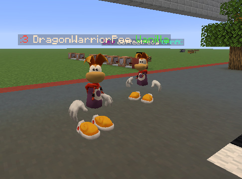
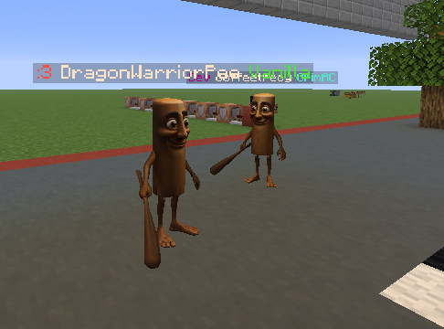

# Model Modifier for Minecraft Fabric 1.21.11
I'll write a cool readme later cause i like this project quite a bit

## Rayman:

## Triple T:

### Features:
- Works with all minecraft effects, such as glowing and invisibility
- Works with minecraft smooth lighting and shading packs
- Only renders armour that doesn't look weird on 3d models, such as helmets and elytra
- You can create your own models via a texture pack [example packs](https://github.com/scoliossis/model-modifier/tree/master/example-resource-pack)
- The models are only rendered on real players and not on server bots

### Todo:
- the demo models are frankly FAR too big, and therefore have quite a hefty fps impact
- write a cooler readme
- make a guide video on how to make models
- it currently hides armour other than helmets, think of a smart way to render other armour without looking weird
- make an easy way to find a good player held item offset

### Create an issue if you find any bugs or have any suggestions!